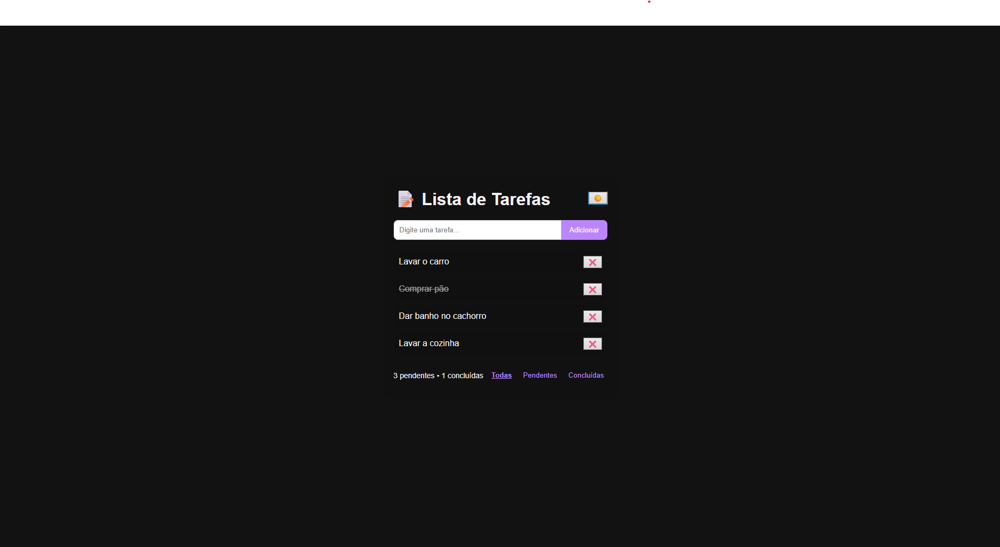

# 📝 Lista de Tarefas

Um projeto simples em **HTML + CSS + JavaScript** para praticar manipulação do DOM, filtros, persistência no navegador e alternância de temas.

---

## 🖼️ Preview
  

---

## 🚀 Demonstração
🔗 [Veja o projeto rodando aqui](https://nxus-lucas.github.io/ListaDeTarefas)  

---

## 🚀 Funcionalidades

- Adicionar novas tarefas
- Marcar como concluída (com clique)
- Remover tarefas
- Contador de pendentes e concluídas
- Filtros (Todas | Pendentes | Concluídas)
- Tema claro/escuro
- Salvar no LocalStorage

---

## 📦 Como usar

1. Baixe ou clone este repositório.
2. Abra o arquivo `index.html` em qualquer navegador moderno.
3. Aproveite sua lista de tarefas! 🎉

---
